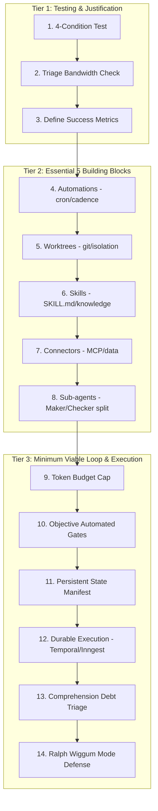

# Loop Engineering (Addy Osmani & Neyzis) — 프롬프터에서 루프 디자이너로 가는 14단계 로드맵

> [!NOTE]
> 이 문서는 기존 Addy Osmani의 원론적 루프 엔지니어링 개념에 Neyzis가 제안한 실무적 **14단계 로드맵(3 Tier 아키텍처)** 및 **지속성 있는 실행(Durable Execution)** 등의 구체적 엔지니어링 패턴을 교차 융합하여 전면 보강한 정본 학습 노트입니다.
> ✅ **vault Claude 검토 (2026-06-27, antigravity 흔적 정리 중 격리 제외)**: 출처 견실(Addy Osmani 실존)·개념 정합(Ralph Wiggum·Comprehension Debt·Temporal/Inngest 실재)·Sub-brain 매핑 충실·환각 수치 0·Phase2 결정 ground-truth 참조 중 → 다른 antigravity 덤프와 달리 유지. ⚠ 공동저자 "Neyzis"(medium 글) 신원 미검증.

"네가 에이전트에게 직접 프롬프트를 치는 사람(Prompter)을 그만두고, **에이전트를 프롬프트하는 시스템(System)을 설계하는 사람(Loop Designer)**이 되어라."
루프 엔지니어링은 단일 에이전트의 일회성 실행을 넘어서, **Automations, Worktrees, Skills, Connectors, Sub-agents**의 5대 블록과 **State/Memory**를 결합하여 에이전트 스스로 작업을 찾고, 수행하고, 검증하고, 다음 단계를 결정하도록 반복 구동하는 고수준 오케스트레이션 패러다임입니다.

---

## 한 줄 요약

> 단순히 LLM에게 매번 일을 시키는 프롬프팅에서 벗어나, 에이전트의 오작동(Ralph Wiggum)과 이해 부채(Comprehension Debt)를 객관적 게이트로 통제하고 Durable Execution(지속성 있는 실행)과 토큰 캡(Budget Cap)으로 백그라운드 구동을 자동화하는 시스템 아키텍처.

---

## 3 Tier 기반의 14단계 로드맵 아키텍처

루프 디자이너로 전환하기 위한 14단계 로드맵은 다음 3개의 Tier로 설계됩니다.

---

## Tier 1: Testing & Justification (루프 도입 평가)

루프는 구축 비용과 토큰 비용이 수반되므로, 무작정 구축하기 전에 반드시 **타당성 검증**을 거쳐야 합니다.

### 1. 루프 적용을 위한 4대 조건 테스트 (4-Condition Test)
다음 4가지 질문에 모두 `YES`인 경우에만 루프 설계를 시작합니다.
- **반복성**: 이 작업이 정기적으로(일간/주간) 혹은 대량으로 반복되는가?
- **객관적 검증성**: 작업의 결과물을 사람이 아닌 코드(테스트, 린트, 빌드)로 성공/실패 판정할 수 있는가?
- **컨텍스트 명확성**: 에이전트가 사전 추측(Guess) 없이 명확한 입력과 스킬 컨트랙트만으로 수행 가능한가?
- **인적 병목 해소**: 이 작업의 자동화가 인간 개발자의 인지 에너지와 검수 시간을 유의미하게 절약하는가?

### 2. 검수 대역폭 측정 (Review Bandwidth Triage)
아무리 정교한 루프라도 최종 승인은 인간의 몫입니다. 루프의 실행 주기가 인간의 검수 대역폭(Review Bandwidth)을 초과하면 컨텍스트 오염과 버그 누적이 발생합니다. 따라서 "작고 읽기 전용인 분류(triage) 루프"로 시작하여 안정성을 확인한 후 쓰기 권한을 점진적으로 확장합니다.

---

## Tier 2: Essential 5 Building Blocks (5대 구성 요소)

루프를 구성하는 5가지 핵심 기술적 벽돌을 마스터하고 프로젝트에 이식합니다.

| 블록 | 핵심 메커니즘 | Sub-brain 대조/확증 매핑 |
|---|---|---|
| **1. Automations** | 특정 이벤트나 시간(cron, cadence)에 따라 백그라운드에서 하네스를 자동 구동하는 심장박동(heartbeat). | `nightly-updater`, 주간 회고 다이제스트 자동화 트랙. |
| **2. Worktrees** | 병렬 에이전트 구동 시 코드 충돌과 오염을 막기 위한 물리적 디렉토리 격리. | `share` 작업 공간 분리, `worktree-accept` 게이트. |
| **3. Skills** | 에이전트가 "추측"하지 않고 수행하도록 도메인 지식과 제약조건을 명세화한 지식 기동판. | `SKILL.md` 자가성장 체계, `expansion-contracts`. |
| **4. Connectors** | 다양한 도구, 데이터베이스, 시스템 리소스와 연동하는 브릿지. | `MCP` (CodeGraph, Chrome DevTools 등 커넥터). |
| **5. Sub-agents** | **Maker(작성자)**와 **Checker(검수자)**를 엄격히 분리. 자기 숙제를 자기가 채점하게 두면 오류를 묵인함. | `③Gate` 검수 구조, N-3 병렬 교차 검증 시스템. |

---

## Tier 3: Minimum Viable Loop & Execution (최소 루프 및 실행 통제)

루프가 통제를 벗어나 자원을 낭비하거나 망가지지 않도록 안전 가이드와 지속성 설계를 적용합니다.

### 6. 객관적 자동화 게이트 (Objective Automated Gates)
에이전트의 작업 완료(Done) 선언은 **Proof(증명)가 아니라 Claim(주장)**에 불과합니다. 
- LLM의 자가 평가나 말글(Text) 검수에만 의존하지 않고, **자동화된 테스트 스위트, 컴파일러 빌드 성공 여부, 엄격한 static linter(SCA-Gate)** 등의 객관적 코드로 1차 차단 게이트를 둡니다.

### 7. 토큰 버짓 캡 (Token Budget Cap) 및 상태 직렬화
- **Runaway Loop 방어**: 에이전트가 해결책을 찾지 못하고 무한 루프를 돌며 수십만 토큰을 낭비하는 사고를 방지하기 위해, 세션당 최대 토큰량과 루프 반복 횟수(Max Iterations)에 대한 물리적인 상한선(Cap)을 반드시 지정합니다.
- **State Manifest**: 루프의 진행 상황, 체크포인트, 롤백 정보를 담은 가벼운 `.json` 형태의 상태 파일을 파일시스템에 보존하여 세션이 끊어져도 이어서 복구할 수 있게 합니다.

### 8. 지속성 있는 오케스트레이션 (Durable Execution)
단순한 `while True`나 메모리 상의 대기 루프는 프로세스 재시작, 서버 다운, 네트워크 에러 시 중간 상태가 모두 소실됩니다. 
- 프로덕션 등급의 루프 엔지니어링을 위해서는 **Temporal, Inngest** 등 상태 저장형(Stateful) 워크플로우 엔진을 활용하여, 네트워크 장애나 시스템 셧다운 중에도 에이전트의 작업 루프가 중단된 지점부터 정확히 이어서 실행(Durable Execution)되도록 아키텍처를 설계합니다.

---

## 핵심 위험 및 가드레일 (Anti-Patterns)

### 1. "랄프 위검" 실패 모드 (Ralph Wiggum Mode)
- **증상**: 에이전트가 동일한 오류(예: 빌드 실패)를 인지하고도, 컨텍스트 윈도우 한계나 얕은 추론으로 인해 똑같은 수정 코드를 바보처럼 반복해서 들이밀며 토큰을 탕진하는 현상.
- **방어**: 오류가 3회 이상 반복 감지되면 즉시 루프를 **하드 홀트(Hard Halt)** 시키고, 인간 개발자의 인풋(HITL)을 강제하거나, 에이전트의 컨텍스트를 강제 compaction 하고 상위 추론 모델로 에스컬레이션합니다.

### 2. 이해 부채 (Comprehension Debt) 및 인지적 굴복 (Cognitive Surrender)
- **이해 부채**: 에이전트가 코드를 너무 빨리, 대량으로 찍어내어 정작 인간 개발자는 코드베이스의 실제 아키텍처를 이해하지 못하고 방치하게 되는 현상. 방치된 이해는 썩어 문드러집니다.
- **인지적 굴복**: 에이전트가 제안한 대안에 대해 인간의 주관(Opinion) 없이 무비판적으로 수용하여 결국 제품의 아키텍처 품질이 망가지는 현상.
- **방어**: **"loop는 일을 바꿀 뿐, 인간을 삭제하지 않는다."** 모든 코드 병합 전 변경의 타당성을 입증하는 `Evidence` 제출 의무화 및 인간의 최종 서명(Sign-off) 단계를 우회 불가능하게 고정합니다.

---

## Sub-brain 연계 및 반영

- **Hermes Loop와의 북극성 수렴**: 본 가이드는 Sub-brain의 핵심 성장 루프인 hermes-loop의 철학적 가치를 완벽히 지지하며, 외부에서 검증된 14단계 구체적 엔지니어링 프레임워크를 수혈합니다.
- **자동화의 선별적 수용(triage)**: 현재 Sub-brain은 인간 창작자의 인지적 통제 유지를 위해 **infra-0(수동 및 극도로 제한된 스케줄러)** 원칙을 고수합니다. 따라서 무분별한 백그라운드 자동 쓰기 루프 도입은 전면 차단하되, **"읽기 전용의 정보 수집 및 Triage 루프"**와 **"주간 회고 다이제스트 자동화"** 영역에서 본 Durable Execution 및 Token Budget Cap 설계를 우선 검토합니다.

---

## 연결된 페이지

- hermes-loop — Sub-brain의 자가 성장 및 스킬 정제 루프 SSOT.
- agent-harness — 단일 세션 내 에이전트 격리 및 성공 조건 명세.
- [EdgeBench — 환경 학습을 "시간-점수 곡선"으로 측정하는 벤치마크](edge-bench.md) — *측정 counterpart*. 여기(Loop Engineering)가 루프를 **설계**한다면, EdgeBench는 그 루프가 환경 피드백으로 실제 학습하는지 시간-점수 곡선으로 **측정**한다.
- [Factory AI — Droid 중심 "AI-native 개발 플랫폼" (vault 아키텍처의 업계 수렴 ground-truth #4)](factory-ai.md) — 에이전틱 개발 플랫폼의 상용화 표준.
- [SCA-Gate & Spike 1A RAG Failure Defense Specification](sca-gate-specification.md) — 객관적 static linter와 충분한 맥락 검증 게이트 사양.
- [Matt Pocock의 에이전틱 워크플로우 (하네스 공학)](matt-pocock-agentic-workflow.md) · [pi 코딩 에이전트 CLI](pi-coding-agent.md) · [Ponytail — "게으른 시니어 개발자"를 13개 코딩 에이전트에 이식하는 portable behavioral skill](ponytail.md) — 모델 독립 에이전트 하네스 *실천 사례* 자매(loop 정련 / skills 워크플로우 / depth 하네스 / 정적 룰셋 주입)
