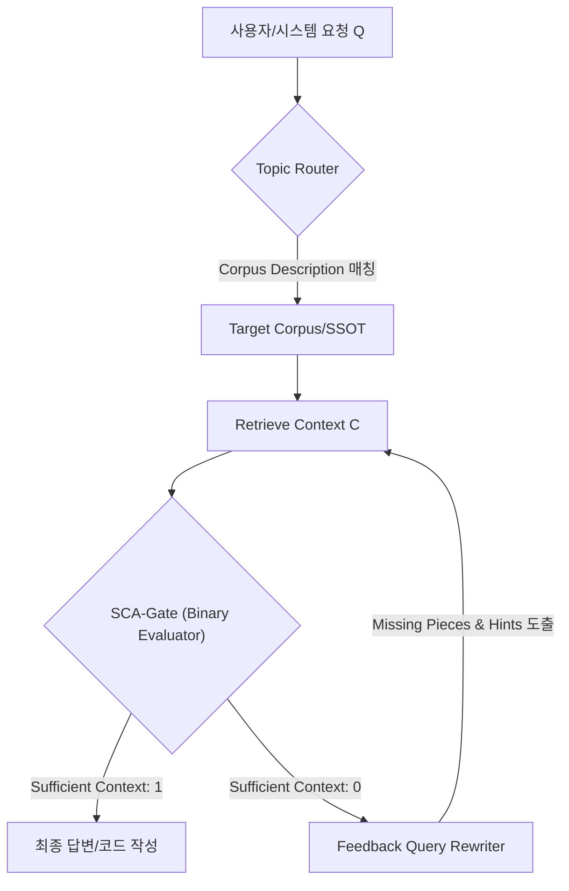

# SCA-Gate & Spike 1A RAG Failure Defense Specification

> ✅ **확정(confirmed) 2026-06-14** — 세션 내 ③Gate 통과 + 작가 수용. (외부 미검증 세부는 본문 표기 유지.)

> [!IMPORTANT]
> 본 문서는 **SCA-Gate (Sufficient Context Assessment)**의 서브브레인 이식 설계와 **libgdx-rogue-os Spike 1A-Dev** 개발 과정에서 발생 가능한 RAG failure 시나리오 및 방어책을 다루는 공식 명세서입니다.

---

## 1. SCA-Gate (Sufficient Context Assessment) 스킬 규격

SCA-Gate는 에이전트(Codex, Gemini 등)가 쓰기(Write) 작업을 수행하거나 기획 의도를 검증할 때, **"질문에 답하거나 설계를 완성하기에 충분한 근거 컨텍스트를 확보했는가"**를 정량적으로 판정(F1 `0.935` 수준의 1-shot autorater)하는 게이트 시스템입니다.

### 1.1 아키텍처 및 제어 흐름
SCA-Gate는 단순히 정보를 조회하는 것을 넘어, 검색된 컨텍스트가 부족할 경우 **피드백 루프**를 트리거하는 Dynamic Guardrail로 작동합니다.



### 1.2 SCA Evaluator 프롬프트 템플릿 (Appendix C.1 커스텀)
우리 Sub-brain의 `wiki_graph_lint.py` 또는 에이전트 사전 실행(Preflight) 단계에서 가동할 autorater 프롬프트 스펙입니다.

```markdown
You are an expert evaluator assessing the sufficiency of the retrieved context to answer a developer query or construct a code block without introducing hallucinations.

[INPUT]
- QUESTION/GOAL: <goal_description>
- REFERENCES: <retrieved_vault_nodes_and_decision_logs>
- SYSTEM_INVARIANTS: <rules_and_negative_checklists>
- TIMESTAMP: 2026-06-09T23:06:48+09:00

[CRITERION]
You must determine if the REFERENCES contain "Sufficient Context" (1 or 0) to fulfill the GOAL exactly as specified.
- "Sufficient Context": 1 (If all constraints, negative checklists, and specifications are deterministically inferable from REFERENCES)
- "Sufficient Context": 0 (If any critical parameter, constraint, or boundary condition is missing, ambiguous, or contradictory)

[REQUIRED REASONING STEPS]
1. Identify all implicit assumptions in the GOAL.
2. List out the negative constraints (e.g., "Do not add new monster archetypes").
3. Verify if the REFERENCES provide explicit values/contracts for all required parameters.

[OUTPUT FORMAT]
Your output MUST follow this format exactly:

### EXPLANATION
- Missing Pieces: (If 0, list exactly what is missing. If 1, write "None")
- Potential Risk: (If 0, what hallucination could occur)
- Reasoning Steps: <step_by_step_analysis>

### EVALUATION (JSON)
```json
{
  "Sufficient Context": 0 or 1,
  "Suggested Search Query": "query to retrieve missing information"
}
```
```

---

## 2. Spike 1A-Dev RAG Failure 시나리오 및 방어책

Spike 1A 5-floor authored run 개발 시, 외부 에이전트(Codex)가 컨텍스트 검색 실패(RAG Failure)로 인해 잘못된 구현을 하거나 스코프 가드를 위반하는 위험을 방지하기 위한 2중 가드레일 전략입니다.

### 2.1 시나리오 A: Context Retrieval Failure (에이전트 계약 위반)
* **상황**: 에이전트가 `design/decision-log.md`를 naive하게 조회하는 과정에서, Context Window 제한이나 Semantic Router의 미스매칭으로 인해 **D-033~D-040 계약(Negative Checklist)**을 인지하지 못하고, "새로운 몬스터 추가", "새로운 소모품 추가" 또는 "PCG/Tiled 코드 통합"과 같은 **금지된 코드**를 작성하는 현상.
* **방어책 (Pre-execution SCA Guard)**:
  1. 에이전트가 Plan을 세운 직후, SCA-Gate가 작동하여 에이전트가 수립한 `Plan`과 `design/decision-log.md`의 `Negative Checklist(D-040 스코프 가드)`를 대조 평가.
  2. "Sufficient Context"가 0으로 판정될 경우(즉, 금지 사항에 대한 대조가 누락된 경우), 에이전트의 터미널 실행을 차단하고 `Missing Pieces` 경고를 출력하여 Plan을 재생성하도록 강제.

### 2.2 시나리오 B: Level Pack Data Loading Failure (데이터 무결성 붕괴)
* **상황**: 5층 authored run을 진행할 때, 층 전환(Floor transition) 시 JSON fixture를 읽어 맵을 로드하는 과정에서 warp gate 위치가 누락되거나, 6번째 floor 생성을 시도하여 NullPointerException 또는 infinite loop에 빠지는 시나리오.
* **방어책 (L1 Headless Validator)**:
  1. 게임 런타임 구동 전, `core/src/main/java/com/author/rogueos/model/LevelValidator.java`에 **D-035 Level-pack 정적 검증기**를 완비.
  2. 각 floor JSON이 로드될 때:
     - entry/start가 정확히 1개인지 검증
     - warp gate가 도달 가능한 곳에 1개 이상 존재하며 벽 통과 없이 갈 수 있는지(Headless Dijkstra field check) 검증
     - 6번째 floor 생성 시도가 감지되면 즉시 exception을 던져 regression 차단.
  3. `./gradlew test`에 이 LevelValidator 검증이 regression suite로 상시 포함되도록 강제하여, 데이터 drift가 코드를 오염시키는 것을 원천 차단.
